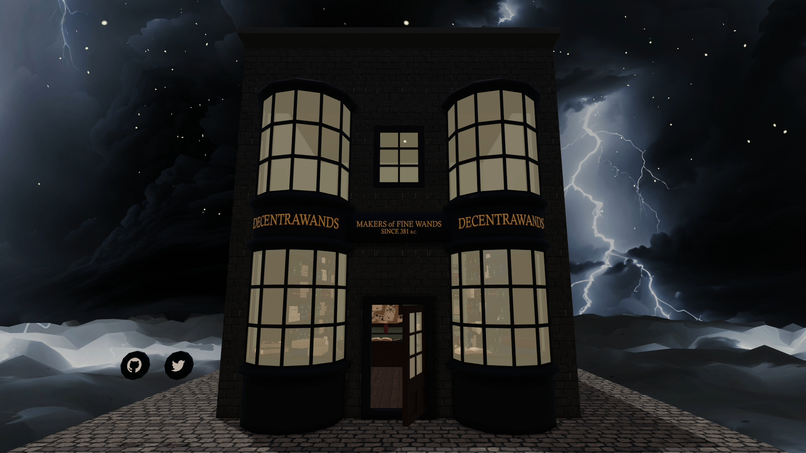
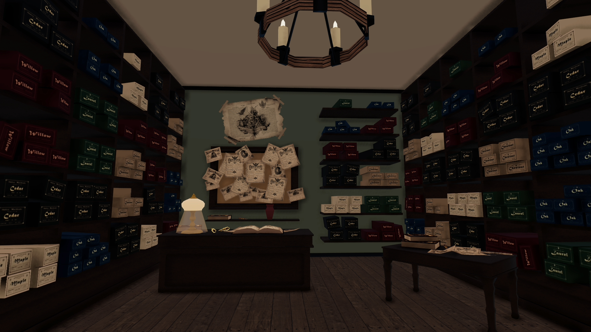
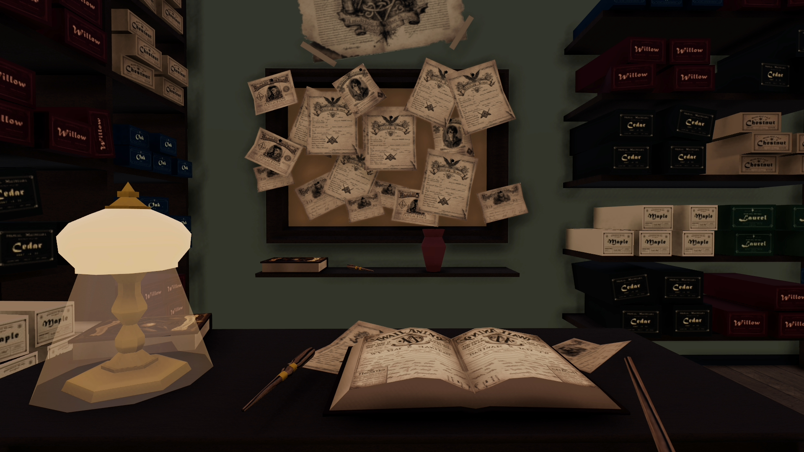

# Decentraland scene

This project contains wand store inspired by Ollivanders wand store from Harry Potter. Created for Sandstorm's Decentraland contest #7 - Movie Marathon.

Currently deployed under Decentraland name `Wizardry`. Follow [this link](https://play.decentraland.org/?realm=wizardry.dcl.eth) or type in the Decentraland chatbox `/changerealm wizardry.dcl.eth` to visit the scene. This scene is built with the SDK7.

Skybox generated using Blockade Labs [Skybox AI tool](https://skybox.blockadelabs.com/) licensed under the [CC BY 4.0 license](https://creativecommons.org/licenses/by/4.0/)





## 3D models

All of the 3D models have been created by me, with the exception of Github and Twitter links, which are from Decentraland Builder.

Textures used in 3D models and their sources:

- Bricks for building: [ambientCG](https://ambientcg.com/view?id=Bricks052). AmbientCG has a nice selection of textures under [Creative Commons CC0 1.0 Universal License](https://docs.ambientcg.com/license/)
- Pavement outside building: [ambientCG](https://ambientcg.com/view?id=PavingStones115A)
- Wood planks for store floor: [ambientCG](https://ambientcg.com/view?id=Planks003)
- Wood used for furniture/doors: [ambientCG](https://ambientcg.com/view?id=Wood028)
- Wood used for wands generated using [Dream Textures](https://github.com/carson-katri/dream-textures)
- Images used as textures for wand boxes, paper notes and books generated using [Midjourney AI](https://www.midjourney.com/)

## Try it out

1. Download this repository.

2. Install the [Decentraland Editor](https://docs.decentraland.org/creator/development-guide/sdk7/editor/)

3. Open a Visual Studio Code window on this scene's root folder. Not on the root folder of the whole repo, but instead on this sub-folder that belongs to the scene.

4. Open the Decentraland Editor tab, and press **Run Scene**

Alternatively, you can use the command line. Inside this scene root directory run:

```
npm i
npm run start
```

## Copyright info

This scene is protected with a standard Apache 2 licence. See the terms and conditions in the [LICENSE](/LICENSE) file.
